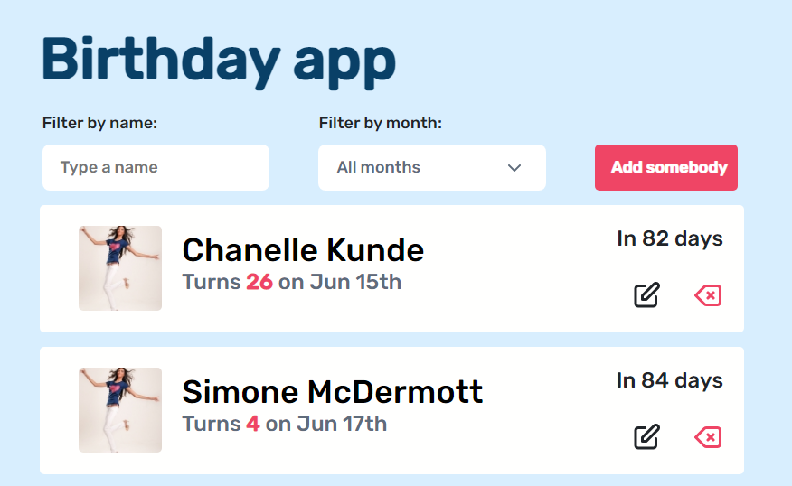
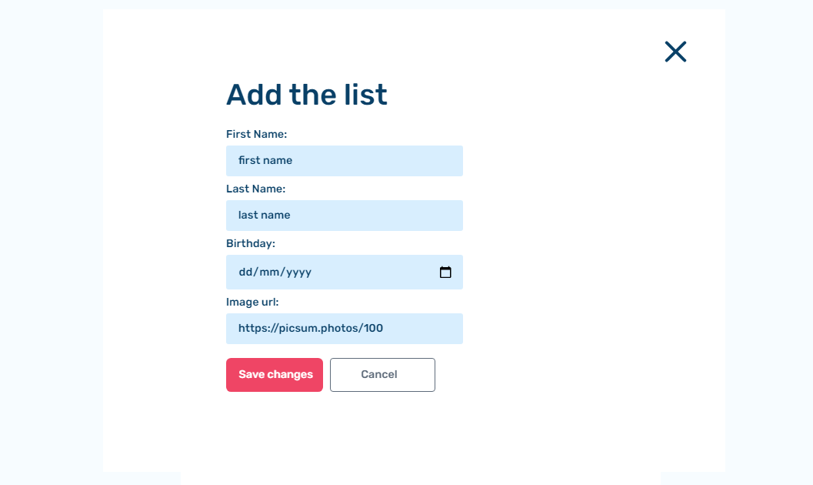
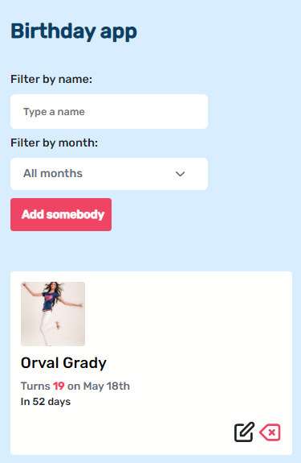

<h1 align="center">Birthday App</h1>

## Screenshot

1. Desktop view

  - Popup 

2. Mobile view

## Design
  Check the design for this app [in this link](https://www.figma.com/file/dqm7MLlazeGPjqyi3UU3fM/Birthday-App-(Copy)?node-id=7%3A72)
## Demo
 The demo of this project can be seen by following this [link](https://birthday-app-rinon.netlify.app/)
## Features
An app that display a list of people with their birthdays and allows pontential users to add and edit a list. 
Users can filter by either a name or a month or a name with a month.
The data was fetched from the server by a given API and stored in the local storage so that it can be used anytime once stored in our local machine.
 
## Technologies used
- Vanilla JS
 
## How to use this project
1. You need to run `npm install` in your bash terminal.
1. Run `npm start` to open or open index.hml file with live server

## Contact
 
-  GitHub [@ganamavo](https://github.com/ganamavo)
-  Twitter [@twitter](https://twitter.com/Tojo_Rinon)
